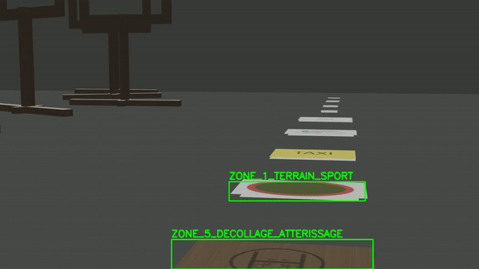

# Project Overview

>[!important]
> It is assumed you are using a linux (work on Ubuntu, not tested on other distros yet).

This project is designed to facilitate the generation of images and the training of an image recognition model using YOLOv8, Blender, and Python. 
The aim is to generate renders of 3D objects in Blender using different lighting conditions, camera angles, and backgrounds.
Alongside these, image labels will also be generated. 
One label is generated for each image.
The name of the label is the same as the name of the image (except for the file extension).
These image-label pairs will then be used to train the YOLO model.

The workspace is divided into several directories, each serving a specific purpose.

## Directory Structure

- **image_generation/**: Scripts and instructions to generate the labels and the 3D models.
- **workplace_setup/**: Scripts and instructions for setting up the environment.
- **yoloV8_training/**: Scripts and resources for training the YOLOv8 model and validating the model with a video.

## Project Overview 
 
 
 

## Additional Resources

- For detailed instructions on training the YOLOv8 model, refer to `yoloV8_training/training_instructions.md`.
- For instructions on generating images, refer to `image_generation/instructions/rendering_instructions.md`.

## Future Improvements
This project was used in a drone competition to recognize objects and zones on the ground using a camera.
It is not totally finished; the script currently only works for individual bodies and cannot handle assemblies at the moment.