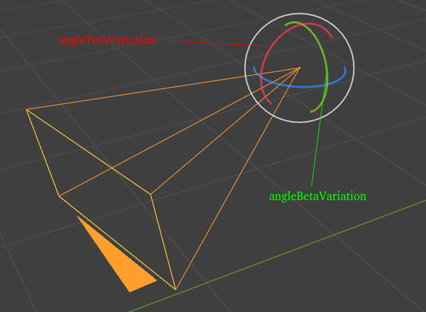
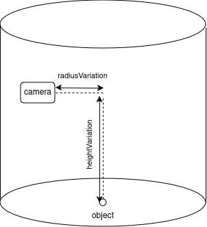

# Introduction
This directory contains the files and the ressources used to generate images and labels which will later be used to train an image recognition model. 


### Configuration
### Ground 
- In order to train the model, different ground images will be used.
- These images must be place in the /ground directory.
- The script will automatically take random images from it as ground texture during the render process.
#### Objects
- In the conf folder there is the config.json file in which we setup the image generation we want to create. 
- There can be multiple objects specified, the script will go through all the configurations and generate the corresponding images and labels.
- **ALL** the objects file must be placed in the */objects folder*
Here is what the configuration in this file should look like:
```json
{
        "id": "object_1",
        "classe": 0,
        "image_width": 800,
        "image_height": 600,
        "render_percentage": 100,
        "samples_number": 30,
        "object_path": "object_1.dae",
        "render_number": 500,
        "radiusVariation": {"min": 0, "max": 150},
        "angleBetaVariation": {"min": -2, "max": 2},
        "angleTetaVariation": {"min": -5, "max": 5},
        "angleRohVariation": {"min": 0, "max": 360},
        "heightVariation": {"min": 20, "max": 300}
    }
```
#### Parameters:
- **id**: string used to identify each config. 
    > **warning**: Do not use multiple times the same id for two differents configs.
- **classe**:  define the classe used in the generated labels.
    > **warning**: The yolo classe number must start from 0.
- **image_width, image_height** :Dimensions in pixels of the generated images.
- **render_percentage**: Percentage at which the image is rendered. Higher value gives higher render quality but take more time to render.
- **sample_number**: define the number of sample used to render the image. Higher value gives higher render quality but take more time to render.
- **objects_path**: name of the object we want to generate a render from. 
    - The object **MUST** be in collada .dae format. 
    - The object file and  all the dependances (images, textures...) are expected to be placed in the */object* folder.
- **render_number**: define how many renders of the object you want to generate.
- The other parameters are used to define the trajectory of the camera.
    - The camera is moving withing a cylinder arroun the objects. 
    Here are illustrations to better understand the parameters defining the trajectory of the camera
    
    


### Installing the required dependencies in blender

Look into **workplace_setup** for further instructions

### Starting the render

In the terminal from the *image_generation* folder run the command: `blender -P generate_render.py`


## Render result

For each object a directory will be created.
Here is an example:
```.
└── zone_1_terrain_sport
    ├── blender
    ├── dataset
    │   ├── all
    │   ├── images
    │   └── labels
    └── yolo
```
- **blender**: a copy of the blender project used to generate the objects is stored
- **dataset**
    - **all** : the image and labels have been put in the same folder to later train the model
    - **images**: images generated by blender
    - **labels**: labels generated
- **yolo** There is initaly nothing in it. Will be used later during the yolo training

